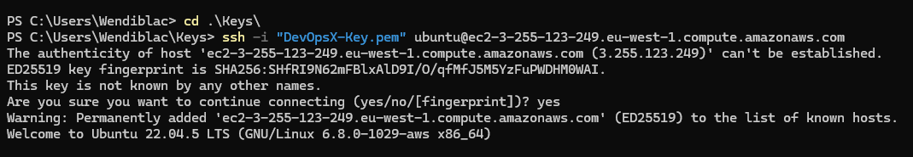
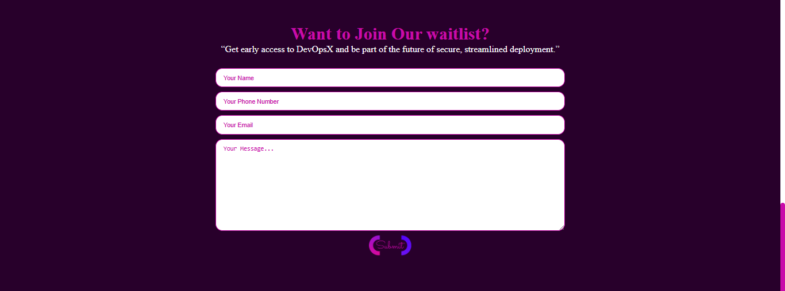

# DevOpsX: Cloud Infrastructure Deployment & Automation 🚀

Welcome to DevOpsX — a comprehensive DevOps project that showcases my ability to deploy, configure, and automate a production-ready cloud infrastructure from scratch.

This hands-on project was part of my second semester exam challenge, where I provisioned and secured an AWS EC2 Linux server, linked a custom subdomain, configured Nginx with SSL, and built a fully automated CI/CD pipeline using Ansible and GitHub Actions.
The goal was to simulate a real-world, investor-ready deployment environment — and I delivered it live at:

🔗 https://devops.wendiblac.com

## 🔧 Project Overview

- **Platform:** AWS EC2 (Ubuntu 22.04 LTS) VPC
- **Automation Tools:** Ansible, GitHub Actions
- **Server:** Nginx
- **CI/CD:** Automatic deployment on `git push`
- **Domain/Subdomain:** `devops.wendiblac.com` (linked via DNS)
- **SSL/TLS:** Enabled with Let's Encrypt & Certbot

## 🚀 Step 1 – EC2 Server Setup on AWS

To begin, I provisioned an EC2 instance from my AWS console. I named the instance `DevOpsX-Server` to match the project branding.

I selected **Ubuntu Server 22.04 LTS** for the AMI because it’s stable, widely supported, and ideal for provisioning with tools like Ansible. Plus, it’s free-tier eligible, which was important for keeping this deployment cost-effective.

For the instance type, I went with **t2.micro**—also free-tier eligible and sufficient for this type of test deployment.

I selected my existing key pair for SSH access.

I chose my preconfigured network setup: a **custom VPC** I had already created, with a public subnet.
 

I also used a **security group** I had tailored beforehand to allow HTTP, HTTPS, and SSH traffic safely.

The complete Network Setup.

After launching the instance, I grabbed the **public IPv4 address**, which I would later use to connect the subdomain. 
I SSH’d into the instance using my WSL terminal on Windows — one of the fastest ways for me to interact with Linux environments directly.

---

## ⚙️ Step 2 – Installing and Preparing Ansible Locally

Next, I installed **Ansible** on my local WSL Ubuntu environment. I started by running:
sudo apt update

sudo apt install software-properties-common -y

sudo add-apt-repository --yes --update ppa:ansible/ansible

sudo apt install ansible -y

ansible --version

Once Ansible was installed, I created a directory to keep the private key to ssh into the instance and the inventory.ini.

I proceeded to add the ssh code line in the inventory.ini file to ssh into the EC2 host securely with the key copied from my local directory.

I then copied my private SSH key into WSL, ensuring I gave it the correct file permissions so Ansible could use it securely.

To test that everything was working, I ran the following command:
**ansible -i inventory.ini web -m ping**
It returned a successful ping from the EC2 instance, which confirmed that I could now use Ansible to automate configurations remotely.

## 📁 Step 3 – Structuring My Project & Writing the Playbook

With the connection set up, I proceeded to set up a playbook **site.yml** and configured it to install and ensure nginx is running. 

I ran the playbook to proceed with the installation using:
ansible-playbook -i inventory.ini site.yml

Once it completed, I tested the public IP of the EC2 instance in the browser and saw the default Nginx landing page. That confirmed that my Ansible configuration and server setup were working properly.

## 🌍 Step 4 – Linking Subdomain and Adding SSL

With the server up, I moved on to connect my subdomain. I already had a main domain hosted on Netlify, so I went into my DNS settings there and created an A record for the subdomain **devops.wendiblac.com** pointing to the EC2’s public IP.

I verified it was propagating correctly by running ping devops.wendiblac.com, which successfully resolved to my EC2 server.

Now that the subdomain worked, I deleted the default Nginx file and created a test file 'Hello from DevOpsX', I proceeded to install Certbot with Nginx support for HTTPS:
sudo apt install certbot python3-certbot-nginx -y
sudo certbot --nginx -d devops.wendiblac.com

This command automatically updated my Nginx configuration and generated a valid SSL certificate from Let’s Encrypt. 

After that, I visited the site and confirmed that the HTTPS lock was showing and the certificate was active.

To prep the site for deployment, I deleted my test files, using sudo rm index.html
 

Before I proceeded to clone my website repo, I ensured Git was installed and updated, by running; sudo apt update && sudo apt install git -y.
 

I then proceeded to clone my project repository from GitHub directly onto the server for the deployment, by running ; sudo git clone https://github.com/Wendiblac/DevOpsX.git .

_used a period at the end to ensure it is cloned into the current directory_

I updated file permissions for web accessibility with chown and chmod then I reloaded the server.

To complete the deployment I then organized and moved my website files into the correct Nginx directory for easy accesibility.

 
Once I refreshed the browser, my full custom landing page loaded under https://devops.wendiblac.com secured and hosted live successfully🚀.

## 🔁 Bonus Step – CI/CD with GitHub Actions + Ansible
I took an extra step to make the deployment process more realistic, I implemented a basic CI/CD pipeline.
I went into my GitHub repo and added the following secrets:
•	SSH_USER – the EC2 username (ubuntu)
•	SSH_HOST – the public IP or domain
•	SSH_KEY – my private key (base64-encoded)

Then I created a GitHub Actions workflow file at .github/workflows/deploy.yml. This workflow runs on every push to the main branch and does the following:
•	Connects to the EC2 instance using SSH
•	Executes my Ansible playbook to redeploy the updated project files
•	Restarts Nginx if necessary
This way, every time I update my code and push to GitHub, the server automatically syncs and reflects the changes live.

I then created a provisioning directory, Inside the provisioning/ folder, I wrote a playbook (ansible.yml) to install and configure Nginx on the EC2 server. I ensured Nginx would start automatically, and added tasks to handle syncing the actual website files into /var/www/devops-test.

After pushing the changes, the Github Actions Workflow and Provisions, I checked the GitHub Actions for Deployment Success 🚀.

✅ Final Outcome 🍾
After all the steps, I had a live, secure website hosted at https://devops.wendiblac.com, deployed on AWS EC2, automated with Ansible, and continuously delivered via GitHub Actions.
This project was a deep, practical dive into the responsibilities of a DevOps/Cloud Engineer. I touched every layer: infrastructure provisioning, server automation, DNS setup, HTTPS, web server config, GitHub integration, and CI/CD.
I learned how to troubleshoot each step, and more importantly, how to think through each decision like an engineer focused on security, efficiency, and scalability.

##🙋🏽‍♀️ About Me##
My name is Wendy Amadi, a passionate Cloud/DevOps Engineer in training. This project is one of many hands-on deployments I’ve done to build real-world skills and demonstrate my understanding of Cloud computing and DevOps practices.
I’m currently seeking internship opportunities where I can apply what I’ve learned, grow under mentorship, and contribute to production-level systems.
If you’re hiring or would like to connect, I’d love to hear from you!

📧 Email: [Email](info@wendiblac.com)
🌐 Website: [Wendiblac](https://www.wendiblac.com)
🔗 LinkedIn: [LinkedIn](https://www.linkedin.com/in/wendiblac)

**Thank you for reading!**

## © Copyright and License

© 2025 Wendy Amadi (Wendiblac). All rights reserved.

This project is licensed for educational and portfolio purposes only. No part of this repository may be copied, reproduced, or used for commercial purposes without explicit permission from the author.

If you'd like to reference or reuse parts of this work, please credit appropriately and link back to this repository: [https://github.com/Wendiblac/DevOpsX](https://github.com/Wendiblac/DevOpsX).
